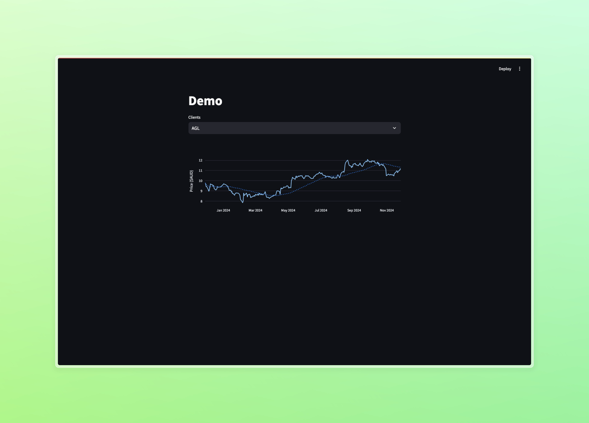

# streamlit-stock-widget

A simple stock widget to enhance our streamlit dashboards quickly. It takes a dictionary of pairs, client: stock code, and returns a plotly graph with a 50 day rolling mean.

Screen capture inside MWE:

